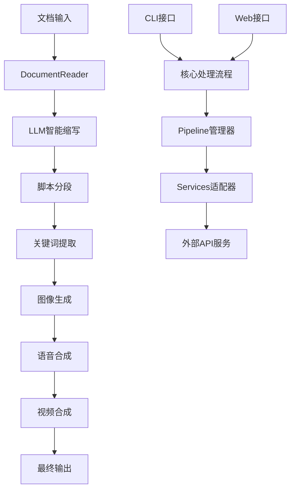

# 智能视频制作系统架构分析与优化方案

## 📋 目录

1. [当前系统架构分析](#当前系统架构分析)
2. [架构优势](#架构优势)
3. [架构缺陷与问题](#架构缺陷与问题)
4. [Web应用发展方向](#web应用发展方向)
5. [优化方案与实施建议](#优化方案与实施建议)
6. [技术债务治理](#技术债务治理)
7. [长期规划建议](#长期规划建议)

---

## 当前系统架构分析

### 🏗️ 整体架构概览

当前系统采用了 **分层模块化架构** + **双接口设计模式**，具体结构如下：

```
AIGC_Video/
├── core/                    # 核心业务层 (业务逻辑与算法)
│   ├── document_reader.py   # 文档解析统一接口
│   ├── text.py             # 文本处理与智能分段
│   ├── services.py         # 第三方API服务封装
│   ├── media.py            # 多媒体内容生成
│   ├── video_composer.py   # 视频合成与特效处理
│   ├── pipeline.py         # 流程编排与状态管理
│   ├── validators.py       # 参数验证与服务商检测
│   └── routers.py          # 内部API路由封装
├── cli/                    # CLI接口层
│   ├── __main__.py         # CLI入口点
│   ├── logging_config.py   # CLI专用日志配置
│   └── ui_helpers.py       # 交互式UI组件
├── web/                    # Web接口层
│   ├── backend/app.py      # Flask后端服务
│   ├── backend/logging_config.py # Web专用日志配置
│   ├── frontend/           # Vue3前端应用
│   └── start_web.py        # Web应用启动脚本
├── config.py               # 全局配置管理
├── prompts.py              # 提示词模板与风格预设
├── utils.py                # 通用工具与项目管理
└── tools/                  # 独立工具集
```

### 🔧 核心设计模式

1. **分层架构模式**
   - **核心层** (core/): 纯业务逻辑，不依赖具体接口
   - **接口层** (cli/, web/): 用户交互逻辑，依赖核心层
   - **配置层** (config.py, prompts.py): 全局配置与模板

2. **服务适配器模式**
   - `core/services.py`: 统一封装多个第三方API
   - 支持 OpenRouter、SiliconFlow、AIHubMix 等多服务商
   - 自动服务商检测与切换机制

3. **管道模式**
   - `core/pipeline.py`: 5步流水线处理
   - 支持自动模式和分步确认模式
   - 状态管理与错误恢复

4. **策略模式**
   - `core/validators.py`: 多种验证策略
   - `prompts.py`: 可配置的图像风格预设
   - `config.py`: 环境相关的配置策略

### 🔄 数据流架构



---

## 架构优势

### ✅ 设计亮点

1. **高度模块化**
   - 核心业务逻辑与接口层完全解耦
   - 单一职责原则，每个模块功能明确
   - 易于测试和维护

2. **双接口支持**
   - CLI和Web版本共享同一套核心逻辑
   - 避免代码重复，保证功能一致性
   - 用户可以根据需求选择合适的交互方式

3. **配置驱动架构**
   - 统一的配置管理系统 (`config.py`)
   - 环境变量与代码分离
   - 支持多环境部署

4. **灵活的服务商支持**
   - 多LLM服务商无缝切换
   - 统一的API调用接口
   - 自动故障转移机制

5. **完整的项目生命周期管理**
   - 项目状态持久化
   - 支持任意步骤重跑
   - 智能进度检测

6. **丰富的错误处理**
   - 分层异常处理机制
   - 详细的日志记录
   - 用户友好的错误提示

---

## 架构缺陷与问题

### ❌ 当前系统存在的问题

#### 1. **核心架构层面**

**问题1：缺乏异步处理能力**
- 当前所有处理都是同步的，处理大文档时UI会阻塞
- CLI版本无法提供实时进度反馈
- Web版本使用线程池但缺乏任务队列管理

**问题2：内存管理不当**
- 大型文档和图像在内存中长时间占用
- MoviePy视频处理时内存峰值过高
- 缺乏内存监控和自动释放机制

**问题3：错误恢复机制不完善**
- API调用失败时重试逻辑简单
- 中间文件损坏时无法自动修复
- 长流程中断后恢复困难

#### 2. **数据持久化层面**

**问题4：缺乏真正的数据库支持**
- 项目数据全部依赖文件系统
- 无法实现复杂的查询和统计
- 多用户并发访问时存在文件锁问题

**问题5：缺乏版本控制**
- 项目修改历史无法追踪
- 无法回滚到之前的版本
- 协作开发时容易产生冲突

#### 3. **性能与扩展性**

**问题6：单机处理能力限制**
- 无法利用多机资源进行分布式处理
- CPU密集型任务(视频合成)缺乏并行优化
- 无法根据负载动态扩缩容

**问题7：缓存机制缺失**
- LLM API调用结果未缓存，重复成本高
- 图像生成结果未去重，资源浪费
- 文档解析结果未缓存，重复处理耗时

#### 4. **安全性问题**

**问题8：API密钥管理不安全**
- .env文件明文存储敏感信息
- 缺乏密钥轮换机制
- Web版本API密钥在前端可见

**问题9：输入验证不够严格**
- 文件上传缺乏类型和大小限制
- 用户输入参数未充分清理
- 路径遍历攻击风险

#### 5. **监控与运维**

**问题10：缺乏监控和指标**
- 无法监控系统运行状态
- 缺乏性能指标收集
- 故障诊断困难

**问题11：日志系统不统一**
- CLI和Web版本各自独立的日志配置
- 日志格式不统一，分析困难
- 缺乏日志轮转和清理机制

---

## Web应用发展方向

### 🌐 向完整Web应用演进的目标

基于当前架构分析，系统需要向 **专业级Web应用** 发展，以满足更广泛的用户需求：

#### 1. **多用户支持**
```
目标：从单用户工具 → 多用户SaaS平台
当前状态：无用户概念，所有数据共享
理想状态：用户注册/登录/权限管理/数据隔离
```

#### 2. **企业级功能**
```
目标：从个人工具 → 企业协作平台  
当前状态：单机处理，无协作功能
理想状态：团队协作/项目分享/权限控制/审批流程
```

#### 3. **云原生架构**
```
目标：从本地部署 → 云原生微服务
当前状态：单体应用，本地文件存储
理想状态：容器化部署/云存储/CDN加速/弹性扩缩容
```

#### 4. **商业化能力**
```
目标：从开源工具 → 商业化产品
当前状态：无计费概念，资源无限制
理想状态：用量计费/套餐管理/支付集成/订阅制
```

### 🚀 Web应用技术演进路径

#### 阶段1：基础Web化 (当前 → 1-2个月)
- ✅ 基本的Web界面 (已完成)
- ⏳ 用户注册登录系统
- ⏳ 数据库持久化改造
- ⏳ 基础的权限控制

#### 阶段2：功能完善 (2-4个月)
- 📋 项目分享与协作
- 📊 使用统计与分析
- 🔔 实时通知系统
- 💳 基础计费功能

#### 阶段3：企业级能力 (4-8个月)
- 🏢 组织架构管理
- 🔐 企业级安全控制
- 📈 高级分析与报表
- 🔄 工作流程自动化

#### 阶段4：云原生转型 (6-12个月)
- ☁️ 微服务架构重构
- 🐳 容器化与Kubernetes部署
- 📡 API Gateway与服务网格
- 🌍 全球CDN与边缘计算

---

## 优化方案与实施建议

### 🔧 短期优化方案 (1-3个月)

#### 1. 异步处理架构升级

**方案：引入Celery任务队列**
```python
# 新增异步任务管理
from celery import Celery

app = Celery('aigc_video')
app.config_from_object('celery_config')

@app.task(bind=True)
def process_video_async(self, config):
    # 异步视频处理逻辑
    # 支持进度回调和任务中断
    pass
```

**实施步骤：**
1. 集成Redis/RabbitMQ作为消息队列
2. 改造核心处理函数为异步任务
3. 实现WebSocket实时进度推送
4. 添加任务状态管理和重试机制

#### 2. 数据库层重构

**方案：引入SQLAlchemy ORM**
```python
# 新增数据模型
class Project(db.Model):
    id = db.Column(db.String(36), primary_key=True)
    title = db.Column(db.String(255), nullable=False)
    user_id = db.Column(db.String(36), db.ForeignKey('user.id'))
    status = db.Column(db.Enum(ProjectStatus))
    created_at = db.Column(db.DateTime)
    config_json = db.Column(db.JSON)
    
class ProcessingStep(db.Model):
    id = db.Column(db.String(36), primary_key=True)
    project_id = db.Column(db.String(36), db.ForeignKey('project.id'))
    step_number = db.Column(db.Integer)
    status = db.Column(db.Enum(StepStatus))
    output_data = db.Column(db.JSON)
```

**实施步骤：**
1. 设计完整的数据模型
2. 实现数据迁移脚本
3. 改造现有文件操作为数据库操作
4. 保持向后兼容性

#### 3. 缓存系统实现

**方案：多层缓存架构**
```python
# Redis缓存层
class CacheManager:
    def __init__(self):
        self.redis_client = redis.Redis()
        self.memory_cache = {}  # 进程内缓存
    
    def get_llm_result(self, prompt_hash):
        # 先查内存缓存，再查Redis
        return self._get_cached_result(prompt_hash)
    
    def cache_llm_result(self, prompt_hash, result):
        # 同时缓存到内存和Redis
        self._set_cached_result(prompt_hash, result)
```

**实施步骤：**
1. 集成Redis作为分布式缓存
2. 实现LLM API调用结果缓存
3. 添加图像生成去重机制
4. 实现文档解析结果缓存

### 🔧 中期优化方案 (3-6个月)

#### 4. 用户管理系统

**方案：完整的用户认证授权系统**
```python
# JWT认证 + RBAC权限控制
class User(UserMixin, db.Model):
    id = db.Column(db.String(36), primary_key=True)
    email = db.Column(db.String(255), unique=True)
    password_hash = db.Column(db.String(128))
    role = db.Column(db.Enum(UserRole))
    subscription_plan = db.Column(db.Enum(PlanType))
    
class Permission(db.Model):
    id = db.Column(db.String(36), primary_key=True)
    name = db.Column(db.String(64), unique=True)
    resource = db.Column(db.String(64))
    action = db.Column(db.String(64))
```

**功能模块：**
- 用户注册/登录/找回密码
- OAuth2第三方登录集成
- 基于角色的权限控制
- 用户配额与限制管理

#### 5. 监控与告警系统

**方案：集成Prometheus + Grafana**
```python
from prometheus_client import Counter, Histogram, Gauge
import time

# 业务指标收集
video_processing_counter = Counter('video_processing_total', 'Total video processing requests')
processing_duration = Histogram('video_processing_duration_seconds', 'Video processing duration')
active_users_gauge = Gauge('active_users', 'Number of active users')

# 装饰器自动收集指标
def monitor_performance(func):
    @wraps(func)
    def wrapper(*args, **kwargs):
        with processing_duration.time():
            video_processing_counter.inc()
            return func(*args, **kwargs)
    return wrapper
```

**监控内容：**
- 系统性能指标(CPU/内存/磁盘)
- 业务指标(处理成功率/耗时分布)
- API调用统计和错误率
- 用户行为分析

#### 6. 微服务架构预备

**方案：服务边界划分**
```
用户服务 (User Service)
├── 用户认证授权
├── 配额与订阅管理
└── 用户偏好设置

文档处理服务 (Document Service)  
├── 文档解析与预处理
├── 文本分析与分段
└── 内容质量评估

媒体生成服务 (Media Service)
├── LLM API调用管理
├── 图像生成与优化
└── 语音合成与处理

视频合成服务 (Video Service)
├── 视频剪辑与特效
├── 字幕生成与同步  
└── 最终渲染与压缩

项目管理服务 (Project Service)
├── 项目生命周期管理
├── 协作与分享功能
└── 版本控制与备份
```

### 🔧 长期优化方案 (6-12个月)

#### 7. 云原生架构转型

**方案：Kubernetes + 云服务集成**
```yaml
# Kubernetes部署配置
apiVersion: apps/v1
kind: Deployment
metadata:
  name: aigc-video-api
spec:
  replicas: 3
  selector:
    matchLabels:
      app: aigc-video-api
  template:
    spec:
      containers:
      - name: api-server
        image: aigc-video/api:latest
        resources:
          requests:
            memory: "512Mi"
            cpu: "250m"
          limits:
            memory: "2Gi"
            cpu: "1000m"
        env:
        - name: DATABASE_URL
          valueFrom:
            secretKeyRef:
              name: db-secret
              key: url
```

**云服务集成：**
- AWS S3/阿里云OSS对象存储
- AWS RDS/阿里云RDS托管数据库
- AWS EKS/阿里云ACK容器服务
- AWS CloudFront/阿里云CDN内容分发

#### 8. AI能力增强

**方案：模型优化与能力扩展**
```python
# 模型管理和切换
class ModelManager:
    def __init__(self):
        self.models = {
            'text_generation': [
                {'name': 'gpt-4', 'cost': 0.03, 'speed': 'medium'},
                {'name': 'claude-3', 'cost': 0.025, 'speed': 'fast'},
                {'name': 'gemini-pro', 'cost': 0.02, 'speed': 'slow'}
            ],
            'image_generation': [
                {'name': 'dall-e-3', 'cost': 0.04, 'quality': 'high'},
                {'name': 'midjourney', 'cost': 0.03, 'quality': 'medium'},
                {'name': 'seedream-3', 'cost': 0.02, 'quality': 'medium'}
            ]
        }
    
    def select_optimal_model(self, task_type, preferences):
        # 根据用户偏好和成本效益选择最优模型
        return self._optimize_model_selection(task_type, preferences)
```

**能力扩展方向：**
- 多语言支持(英文、日文等)
- 视频风格迁移
- 自动配音员声音克隆
- 智能剪辑点推荐
- 内容质量自动评估

---

## 技术债务治理

### 📊 当前技术债务评估

#### 高优先级债务
1. **同步处理阻塞问题** (影响级别：高)
   - 估计解决时间：2-3周
   - 风险：用户体验差，系统不稳定

2. **内存泄漏风险** (影响级别：高)
   - 估计解决时间：1-2周
   - 风险：长时间运行后系统崩溃

3. **API密钥安全问题** (影响级别：高)
   - 估计解决时间：1周
   - 风险：安全漏洞，合规问题

#### 中优先级债务
4. **日志系统不统一** (影响级别：中)
   - 估计解决时间：1周
   - 风险：运维困难，故障排查低效

5. **缺乏单元测试** (影响级别：中)
   - 估计解决时间：3-4周
   - 风险：重构困难，回归风险高

6. **文档更新滞后** (影响级别：中)
   - 估计解决时间：1-2周
   - 风险：开发效率降低，用户使用困难

#### 低优先级债务
7. **代码注释不完整** (影响级别：低)
   - 估计解决时间：2-3周
   - 风险：代码可维护性差

8. **配置参数散乱** (影响级别：低)
   - 估计解决时间：1周
   - 风险：配置管理混乱

### 🔧 债务治理计划

#### 第1阶段：安全性修复 (优先级最高)
```bash
# 1. API密钥管理改造
Week 1: 
- 实现Azure Key Vault/AWS Secrets Manager集成
- 添加密钥轮换机制
- 前端API密钥移除

# 2. 输入验证加强
Week 2:
- 文件上传类型和大小限制
- 参数清理和SQL注入防护  
- XSS攻击防护
```

#### 第2阶段：性能优化 (影响面大)
```bash
# 3. 异步处理改造
Week 3-4:
- Celery任务队列集成
- WebSocket进度推送
- 任务状态管理

# 4. 内存管理优化
Week 5:
- MoviePy内存优化
- 大文件流式处理
- 定期垃圾回收
```

#### 第3阶段：质量提升 (长期效益)
```bash
# 5. 测试覆盖率提升
Week 6-8:
- 核心模块单元测试 (目标70%覆盖率)
- 集成测试套件
- 性能回归测试

# 6. 日志系统统一
Week 9:
- 统一日志格式标准
- 结构化日志输出
- 日志轮转与清理
```

---

## 长期规划建议

### 🎯 1年期发展目标

#### Q1目标：基础设施完善
- ✅ 异步处理架构完成
- ✅ 用户管理系统上线
- ✅ 基础监控告警部署
- 📊 **目标指标**：系统稳定性99.5%，平均响应时间<5秒

#### Q2目标：功能能力扩展
- 📈 多语言内容支持
- 🤝 团队协作功能上线
- 💰 基础计费系统部署
- 📊 **目标指标**：用户留存率>60%，月活用户增长50%

#### Q3目标：企业级能力
- 🏢 企业版功能发布
- 🔐 高级安全认证
- 📋 工作流自动化
- 📊 **目标指标**：企业客户占比>30%，客单价增长100%

#### Q4目标：云原生转型
- ☁️ 微服务架构部署
- 🌍 全球化服务能力
- 🤖 AI能力持续增强
- 📊 **目标指标**：全球用户数破10万，系统处理能力提升5倍

### 🔮 3年期愿景规划

#### 2025年：行业领先平台
- 成为视频内容生产领域的标杆产品
- 支持100+种内容格式和50+种输出样式
- 月处理视频数量达到100万+
- 全球用户数突破1000万

#### 2026年：生态系统构建  
- 开放API平台，支持第三方集成
- 插件市场和模板商城
- 与内容平台深度集成(YouTube、B站等)
- 建立内容创作者生态圈

#### 2027年：AI原生产品
- 端到端AI自动化内容生产
- 个性化推荐和智能优化
- 多模态内容理解和生成
- 成为内容创意助手的行业标准

### 📈 关键指标体系

#### 技术指标
- **系统可用性**：99.9% → 99.95% → 99.99%
- **处理性能**：10分钟 → 5分钟 → 2分钟 (标准1000字视频)
- **并发处理**：10个 → 100个 → 1000个
- **错误率**：<5% → <2% → <0.5%

#### 业务指标  
- **用户规模**：1K → 100K → 1M
- **内容产出**：1K视频/月 → 100K视频/月 → 1M视频/月
- **用户留存**：30% → 60% → 80% (月活留存)
- **收入增长**：0 → $100K/月 → $1M/月

#### 产品指标
- **功能完整性**：基础版 → 专业版 → 企业版
- **易用性评分**：7分 → 8.5分 → 9分 (满分10分)
- **内容质量**：75% → 85% → 90% (用户满意度)
- **创作效率**：5倍 → 10倍 → 20倍 (相比手工制作)

---

## 📋 实施优先级矩阵

### 高影响 & 低成本 (立即实施)
1. **API密钥安全改造** - 安全风险消除
2. **日志系统统一** - 运维效率提升  
3. **内存泄漏修复** - 系统稳定性保障
4. **基础单元测试** - 代码质量保障

### 高影响 & 高成本 (重点规划)
5. **异步处理架构** - 用户体验根本改善
6. **数据库层重构** - 扩展能力基础
7. **用户管理系统** - 商业化必备能力
8. **监控告警系统** - 运维能力跃升

### 低影响 & 低成本 (持续优化)
9. **代码注释完善** - 长期可维护性
10. **配置管理规范** - 开发效率优化
11. **文档更新维护** - 用户体验改善
12. **开发工具优化** - 团队效率提升

### 低影响 & 高成本 (谨慎评估)
13. **全面重构架构** - 风险过高，暂缓
14. **复杂AI功能** - ROI不明确，分阶段实施
15. **过度工程化** - 避免过早优化
16. **小众功能开发** - 优先级最低

---

## 结论与建议

### 🎯 核心建议

1. **立即行动项**：优先解决安全性和稳定性问题，确保系统基础健康
2. **中期重点**：构建异步处理能力和用户管理系统，为规模化做准备  
3. **长期愿景**：向云原生微服务架构演进，构建企业级产品能力

### 📊 投入产出预估

- **短期投入** (1-3个月)：2-3人月开发工作量，预期用户体验显著改善
- **中期投入** (3-6个月)：5-8人月开发工作量，预期支撑10倍用户增长
- **长期投入** (6-12个月)：15-20人月开发工作量，预期构建行业竞争优势

### ⚠️ 风险提示

1. **技术风险**：大规模重构可能影响现有功能稳定性
2. **资源风险**：长期规划需要持续的人力和资金投入
3. **市场风险**：技术方向需要与市场需求保持同步
4. **竞争风险**：行业发展迅速，需要保持技术领先性

### 🚀 成功关键因素

1. **渐进式改造**：避免激进重构，保证系统持续可用
2. **用户导向**：所有技术决策都要以用户价值为导向
3. **团队能力**：确保技术团队具备相应的技术栈能力  
4. **持续监控**：建立完善的监控体系，及时发现和解决问题

---

**文档版本**：v1.0  
**创建时间**：2025年1月  
**下次评审**：2025年4月  
**负责团队**：技术架构组